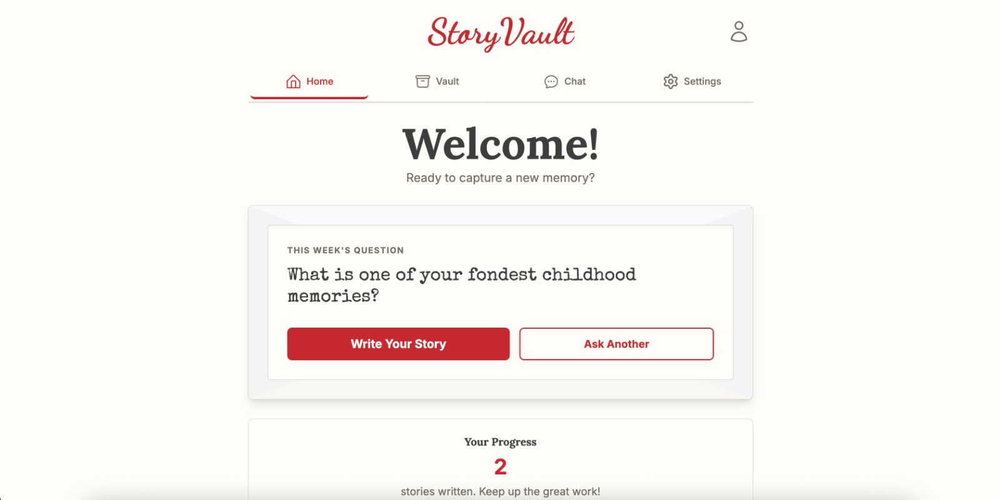
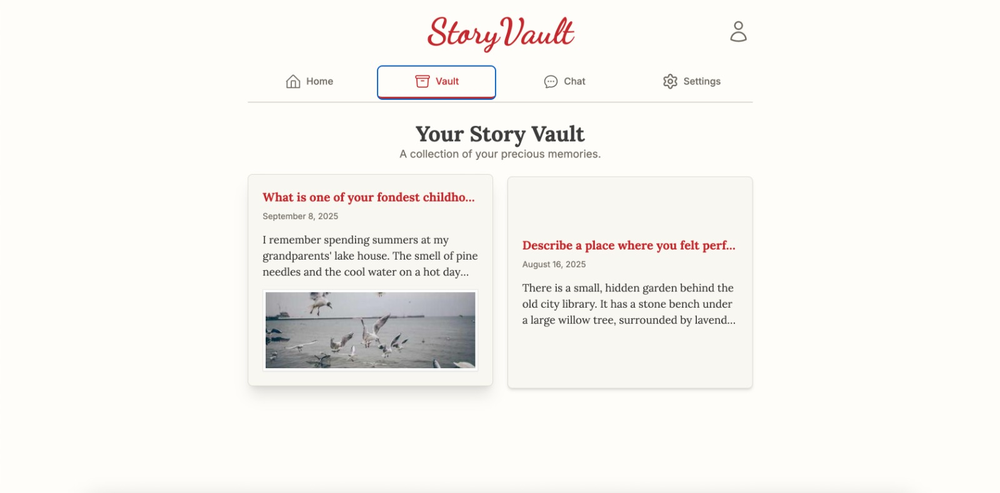
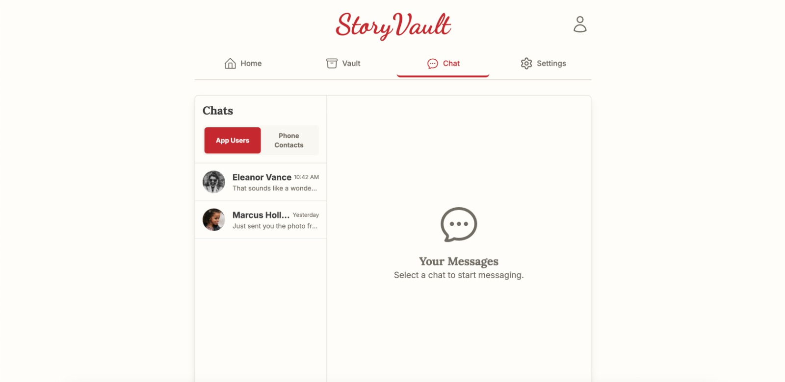
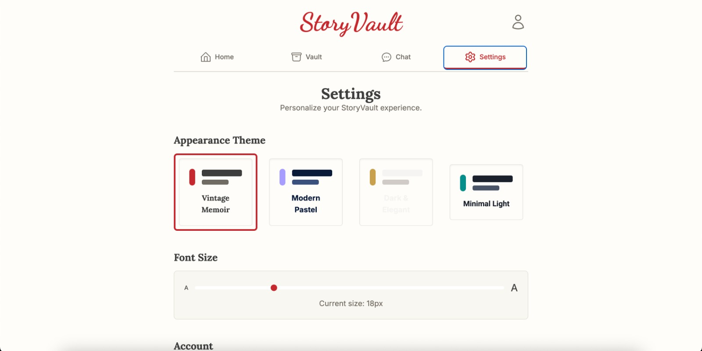

# StoryVault

A story-preservation web application designed for accessibility and simplicity. Users receive weekly prompts to write stories, which they can save, illustrate with photos, and export as a beautifully formatted PDF.
It allows users to write stories, attach photos, and save them in a personal vault.  
This prototype demonstrates the design and functionality of the app.

---

## Project Setup
### Requirements

- Node.js (v16 or higher recommended)
- npm (comes with Node.js)

### Installation

1. Download the ZIP file of this project.
2. Extract the contents into a folder on your system.
3. Open a terminal / PowerShell in the project folder.
4. Run the following commands:

### Install dependencies

```bash
npm install
```

### Start the development server

```bash
npm run dev
```

### Snapshots
 

 

 

 
